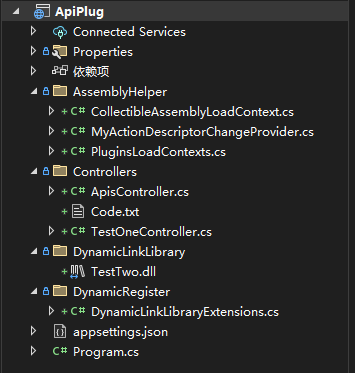

# ApiPlug
.NET Core 6 WebApi热插拔简易代码实现

# 简单介绍


## AssemblyHelper
这是自己封装的当前加载的动态链接库的工具类，因为WebApi更新的时候需要刷新Controllers，不然是不会生效的，详情可以去看代码，我都写了注释的
## Controllers
简单的几个方法，通过代码生成动态链接库和操作动态链接库的插拔，TestOne是个代码例子，复制他的代码传入生成动态链接库的方法里

## DynamicLinkLibrary
这是生成后的DLL会保存在这里，如果这个文件只有1kb,2kb左右，说明生成的有问题，可以用反编译工具看看

## DynamicRegister
这是通过代码生成动态链接库的工具类，代码很简单，还有另外一种方式这里没写，感兴趣可以去看我掘金的WPF的动态链接库的文章，里面介绍了两种方式生成

## 最重要的是在Progtam里添加以下代码
```csharp
#region 插件化开发
//依赖注入监听动态连接池变化
builder.Services.AddSingleton<IActionDescriptorChangeProvider>(ActionDescriptorChangeProvider.Instance);
builder.Services.AddSingleton(ActionDescriptorChangeProvider.Instance);
//启动载入所有动态连接池
var mvcBuilders = builder.Services.AddMvc();
mvcBuilders.ConfigureApplicationPartManager(apm =>
{
    var context = new CollectibleAssemblyLoadContext();
    DirectoryInfo DirInfo = new DirectoryInfo(Path.Combine(Directory.GetCurrentDirectory(), "DynamicLinkLibrary"));
    FileInfo[] DynamicLinkLibrarys = DirInfo.GetFiles();
    foreach (FileInfo DynamicLinkLibrary in DynamicLinkLibrarys)
    {
        var assembly = context.LoadFromStream(new FileStream(DynamicLinkLibrary.FullName, FileMode.Open));
        //var assembly = Assembly.LoadFile(DynamicLinkLibrary.FullName);
        var controllerAssemblyPart = new AssemblyPart(assembly);
        apm.ApplicationParts.Add(controllerAssemblyPart);
        PluginsLoadContexts.AddPluginContext(DynamicLinkLibrary.Name, context);
    }
});

mvcBuilders.SetCompatibilityVersion(CompatibilityVersion.Latest);
#endregion
```